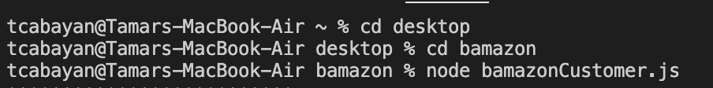

# bamazon
A CLI Storefront With MySQL Backend

This application implements a simple command line based storefront using the npm inquirer package and the MySQL database backend together with the npm mysql package. You can see a deployed version of the app here https://tcabayan.github.io/bamazon/ [GitHub](http://tcabayan.github.com).

My role in this project has been developing the code that brings this idea to life. 

**Instructions:**

1. Clone the repository below

    git@github.com:tcabayan/bamazon.git

1. Install NPM package using _npm i_. In particular, ensure you have installed inquirer (npm install inquirer) and mysql (npm install mysql).

1. Run the SQL script in the bamazon.sql file. 
    
    The table generated by mysql workbench looks a little something like this:

    

1. Navigate to the file path where the bamazon contents are located on your computer.

    Type in the following command to get bamazon working:

    Command: node node bamazonCustomer.js

    The terminal will look a little something like this:

    

1. Once you run the command, you will see a display of ten products offered by Bamazon. You will be asked to type in the ID Number of the item you are interested   in. Once you have selected the item, you will be asked to provide the quantity of the item you wish to purchase. If your quantity is within the range of stocked items, a message will appear that your order has been placed. If not, you will receive a notice that there is insufficient quantity to fulfill your order. 

    The terminal will look a little something like this when the order is successful :

    

    The terminal will look a little something like this when the order is not successful:

    

